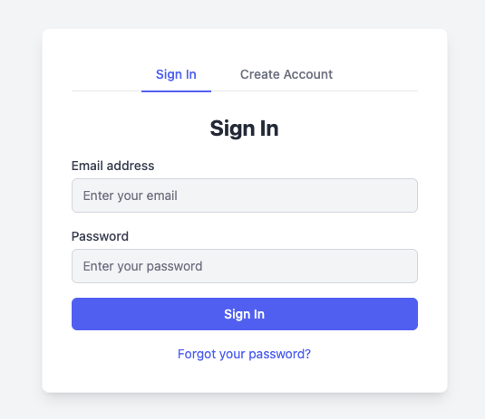

# sveltekit-amplify-starter



SvelteKit + Amplify Gen2 (Hosting, Backend)

## features

- Authentication flow on Server-side rendering (SSR)
- Utility components for Amplify and authentication

## usage

1. Copy or Fork this repository
2. Connect your repository in the Amplify Console
3. Done

## tips

- `amplify_outputs.json` generated by Amplify CLI on build time or sandbox mode and should not be modified manually and so it is `.gitignore`d. `amplify_outputs.json` is loaded by [./src/routes/+layout.svelte](./src/routes/+layout.svelte) and passed to `AmplifyInit` component.
- Using `aws-amplify` as ssr-mode.
  - but ssr-mode doesn't look supporting social login yet.

## references

- <https://docs.aws.amazon.com/amplify/latest/userguide/get-started-sveltekit.html>
- <https://github.com/gzimbron/amplify-adapter>

## development

```sh
npm install
npm run sandbox
npm run dev
```

## license

MIT
